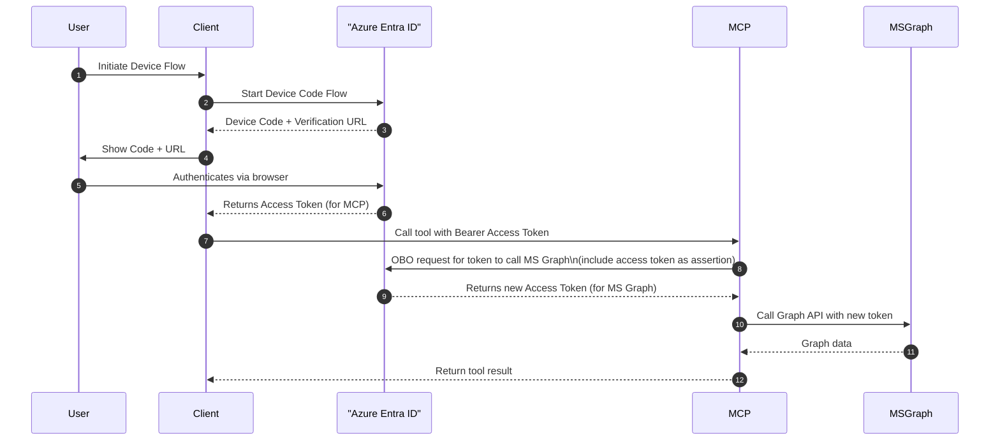

# Diagrams

```mermaid
sequenceDiagram
    autonumber
    participant User
    participant Client
    participant AzureAD as "Azure Entra ID"
    participant MCP
    participant MSGraph

    User->>Client: Initiate Device Flow
    Client->>AzureAD: Start Device Code Flow
    AzureAD-->>Client: Device Code + Verification URL
    Client->>User: Show Code + URL

    User->>AzureAD: Authenticates via browser
    AzureAD-->>Client: Returns Access Token (for MCP)

    Client->>MCP: Call tool with Bearer Access Token
    MCP->>AzureAD: OBO request for token to call MS Graph\n(include access token as assertion)
    AzureAD-->>MCP: Returns new Access Token (for MS Graph)

    MCP->>MSGraph: Call Graph API with new token
    MSGraph-->>MCP: Graph data
    MCP-->>Client: Return tool result
```